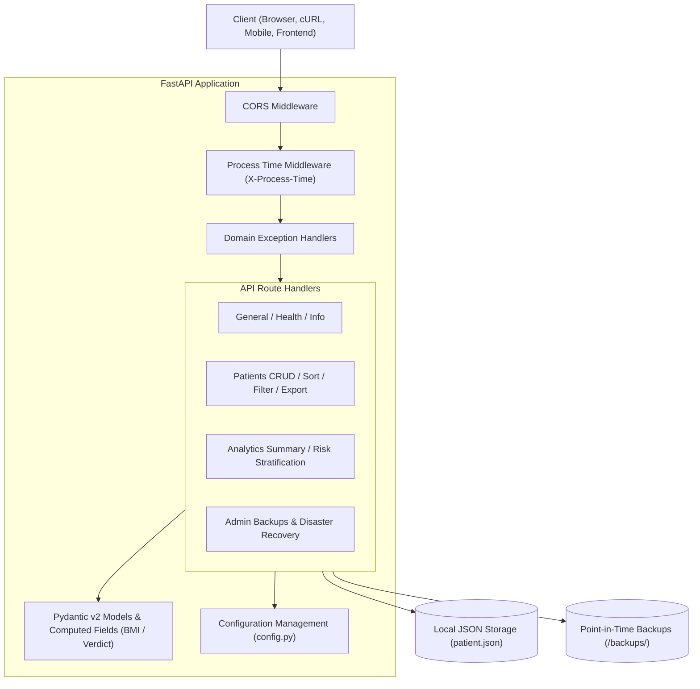

# 🏥 FastAPI Patient Management System

[](https://github.com/ekta1912/FastApi/actions/workflows/ci.yml)


A production-ready, high-performance RESTful API built with **FastAPI** and **Pydantic v2** for managing patient health records, calculating real-time clinical metrics (BMI and WHO health verdicts), evaluating cardiovascular/metabolic risk profiles, and performing point-in-time database backups.

---

## 🏛️ System Architecture



---

## 🚀 Key Features

- **Full Patient Lifecycle Management (CRUD)**: Create, view, update, and delete patient records with unique identifiers and type-safe validation.
- **Computed Health Metrics**: Real-time Body Mass Index (BMI) and WHO health classifications (*Underweight*, *Normal*, *Overweight*, *Obese*) computed automatically via `@computed_field`.
- **Clinical Risk Assessment**: Stratifies patients into clinical risk categories (*Low*, *Moderate*, *High*, *Critical*) based on age and BMI vulnerability factors.
- **High-Risk Filtering**: Dedicated clinical triage endpoint (`/patients/high-risk`) to quickly isolate vulnerable patients.
- **CSV Data Streaming & Export**: Export the entire patient registry directly as a downloadable CSV file (`/patients/export/csv`).
- **Administrative Backups & Recovery**: Create point-in-time JSON snapshots (`/admin/backup`), list existing backups, and restore the database seamlessly with path security verification.
- **Atomic Batch Registration**: Bulk register patient records in a single transactional operation with intra-batch duplicate detection.
- **Advanced Multi-Criteria Search & Pagination**: Query patients by city, gender, age range, and BMI verdict with `limit` and `offset` support.
- **Dynamic Metric Sorting**: Sort patient registries dynamically by height, weight, or calculated BMI in ascending or descending order.
- **Enterprise Middleware**:
  - Global **CORS** middleware with configurable origin whitelists.
  - Request performance profiling with automated `X-Process-Time` response headers.
- **Standardized Error Handling**: Custom domain exceptions (`PatientNotFoundError`, `PatientAlreadyExistsError`, `InvalidQueryParameterError`) with structured JSON error envelopes.
- **Production Containerization**: Multi-stage `Dockerfile` and `docker-compose.yml` with built-in container healthchecks.
- **Automated CI/CD**: Matrix testing across Python 3.10, 3.11, 3.12, and 3.13 via GitHub Actions.

---

## 🛠️ Tech Stack

| Technology | Purpose |
|---|---|
| **Python 3.10+** | Core programming language runtime |
| **FastAPI** | High-performance asynchronous web framework |
| **Pydantic v2** | Data modeling, validation, and settings management |
| **Uvicorn** | ASGI web server for asynchronous request dispatching |
| **Pytest** | Automated unit and integration testing suite |
| **HTTPX / TestClient** | Client-side test fixtures and endpoint verification |
| **Docker & Compose** | Containerized deployment and local orchestration |

---

## 📦 Getting Started

### Option A: Local Python Environment

1. **Clone the repository**:
   ```bash
   git clone https://github.com/ekta1912/FastApi.git
   cd FastApi
   ```

2. **Create and activate a virtual environment**:
   ```bash
   # Windows (PowerShell)
   python -m venv myenv
   myenv\Scripts\activate

   # macOS / Linux
   python3 -m venv myenv
   source myenv/bin/activate
   ```

3. **Install dependencies**:
   ```bash
   pip install -r requirements.txt
   ```

4. **Launch the development server**:
   ```bash
   uvicorn main:app --reload --host 0.0.0.0 --port 8000
   ```

### Option B: Docker & Docker Compose

Run the entire service in an isolated, containerized environment:

```bash
docker compose up -d --build
```

To view live container logs:
```bash
docker compose logs -f
```

To stop the container:
```bash
docker compose down
```

---

## ⚙️ Environment Configuration

The application uses `config.py` with environment variable overrides:

| Variable | Default Value | Description |
|---|---|---|
| `APP_NAME` | `Patient Management System API` | Name displayed in OpenAPI documentation |
| `APP_VERSION` | `1.0.0` | Semantic API version |
| `APP_ENV` | `production` | Execution environment (`development`, `staging`, `production`) |
| `APP_DEBUG` | `false` | Enable or disable debug mode |
| `CORS_ORIGINS` | `*` | Comma-separated list of allowed origins |
| `DATA_FILE_PATH` | `./patient.json` | Path to the persistent JSON storage file |

---

## 📖 Interactive Documentation

Once the server is running, explore the interactive documentation:
- **Swagger UI**: [http://127.0.0.1:8000/docs](http://127.0.0.1:8000/docs)
- **ReDoc**: [http://127.0.0.1:8000/redoc](http://127.0.0.1:8000/redoc)

---

## 📌 Complete API Endpoint Reference

### General & System
| Method | Endpoint | Description |
|---|---|---|
| `GET` | `/` | API landing welcome message |
| `GET` | `/health` | System health check, active records, version, and environment |
| `GET` | `/about` | API description and capabilities |

### Patient Operations
| Method | Endpoint | Description |
|---|---|---|
| `GET` | `/view` | Retrieve all registered patient records |
| `GET` | `/patient/{patient_id}` | Retrieve details and calculated metrics for a patient |
| `GET` | `/sort` | Sort patients by `height`, `weight`, or `bmi` (`asc` or `desc`) |
| `GET` | `/patients/search` | Advanced multi-parameter search with pagination |
| `GET` | `/patients/high-risk` | Retrieve patients in `High` or `Critical` risk tiers |
| `GET` | `/patients/export/csv` | Download patient database as a formatted CSV file |
| `POST` | `/create` | Register a new single patient record |
| `POST` | `/batch-create` | Atomically register multiple patient records |
| `PUT` | `/edit/{patient_id}` | Partially update patient details and recalculate metrics |
| `DELETE` | `/delete/{patient_id}` | Remove a patient record by ID |

### Population Analytics & Risk
| Method | Endpoint | Description |
|---|---|---|
| `GET` | `/analytics/summary` | Population statistics (averages, gender & BMI distribution) |
| `GET` | `/analytics/risk-assessment` | Clinical risk breakdown and factor analysis |

### Administration & Backups
| Method | Endpoint | Description |
|---|---|---|
| `POST` | `/admin/backup` | Create a timestamped point-in-time JSON database snapshot |
| `GET` | `/admin/backups` | List all historical backups in storage |
| `POST` | `/admin/restore` | Restore database state from a specified backup snapshot |

---

## 🧪 Automated Testing

Execute the comprehensive test suite with `pytest`:

```bash
# Run tests with detailed output
pytest test_main.py -v
```

All 29 tests cover:
- Core CRUD flows and validation constraints.
- Real-time BMI and verdict computation.
- Batch creation and duplicate detection.
- Sorting and multi-field search with pagination.
- Population health analytics and risk assessments.
- CSV export streaming headers and format.
- Administrative backup generation and restoration.
- CORS headers and `X-Process-Time` timing middleware.
- Structured domain exception responses (400, 404, 422).

---

## 📄 License

This project is licensed under the [MIT License](LICENSE).
